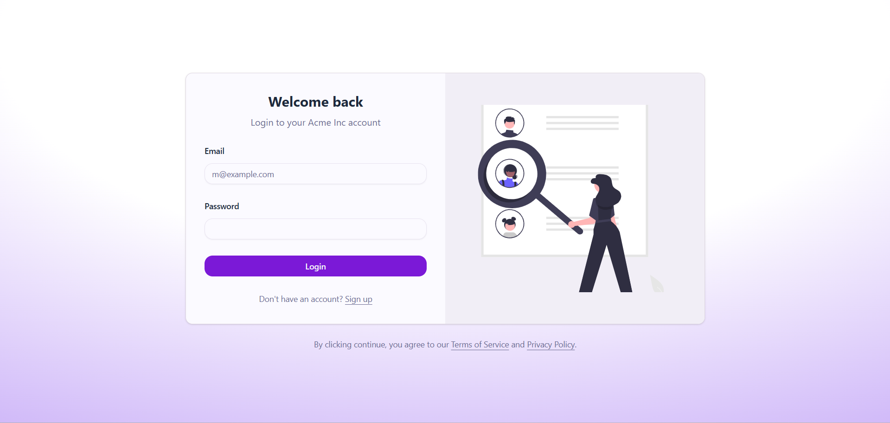
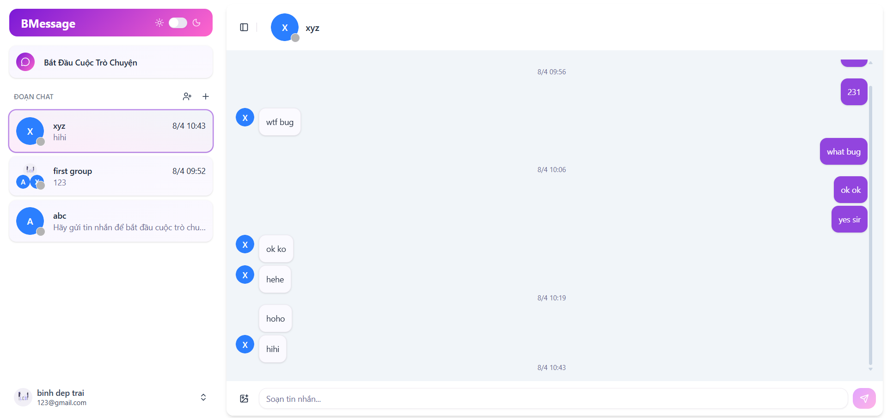

# 💬 BMessage

> BMessage is a real-time messaging application that allows users to connect and communicate via personal and group chats flexibly, smoothly, and securely.

## 📋 Table of Contents

- [✨ Features](#-features)
- [📸 Preview](#-preview)
- [🛠 Tech Stack](#-tech-stack)
- [🚀 Installation](#-installation)

## ✨ Features

- 🔒 **Security & Authentication:** Secure registration and login using JWT (supports both Access Token and Refresh Token).
- 👥 **Friend Management:**
  - Search for users.
  - Send friend requests.
  - View friend list.
- 🟢 **Active Status:** Automatically displays user's online/offline status.
- 💬 **Chat & Messaging:**
  - Supports personal chats and group chats.
  - Smoothly load old messages without slowing down the application thanks to **Infinite Scroll**.
  - Send and receive text messages and application events in real-time.

## 📸 Preview

<p align="center" style="display: flex; gap: 16px">
  
  
</p>

## 🛠 Tech Stack

This repository specifically details the **Frontend** processing of BMessage:

- **Core Framework:** Next.js
- **Language:** TypeScript
- **Styling & UI Components:** Tailwind CSS, shadcn/ui
- **API Communication:** Axios
- **Real-time:** WebSocket
- **Authentication Mechanism:** JWT (Separated Access & Refresh Tokens)

_(Note: The source code and Backend technology are stored and described in a separate Backend repository)._

## 🚀 Installation

### 1. Prerequisites

- [Node.js](https://nodejs.org/) (Version v18 or higher is recommended)
- Node package manager: `npm`

### 2. Running the Frontend Application

1. **Clone the repository:**

   ```bash
   git clone [project_url]
   cd bmessage
   ```

2. **Install dependencies:**

   ```bash
   npm install
   ```

3. **Environment Configuration (`.env`):**
   Create a `.env` or `.env.local` file in the root directory to configure 3 mandatory connection parameters:

   ```env
   # 1. URL pointing to the root of the Backend Server
   NEXT_PUBLIC_BACKEND_URL=your_backend_url

   # 2. Route Configuration for Next.js Rewrite
   # Because in a real environment, the Frontend and Backend applications are deployed on
   # 2 different domains, direct API requests can cause CORS errors.
   # Next.js Rewrite feature is applied to proxy (act as an intermediary gateway)
   # pushing Requests from client to the backend API to hide the official domain,
   # while avoiding CORS issues from the browser.
   NEXT_PUBLIC_API_URL=/api

   # 3. URL to establish WebSocket service connection (e.g. server ws://...)
   NEXT_PUBLIC_SOCKET_URL=your_socket_url
   ```

4. **Start the development server:**

   ```bash
   npm run dev
   ```

   After the Terminal startup is complete, open your browser and experience the application at the URL: [http://localhost:3000](http://localhost:3000)
